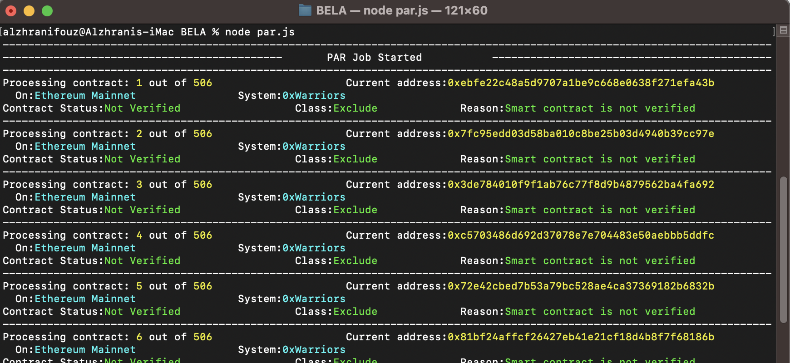
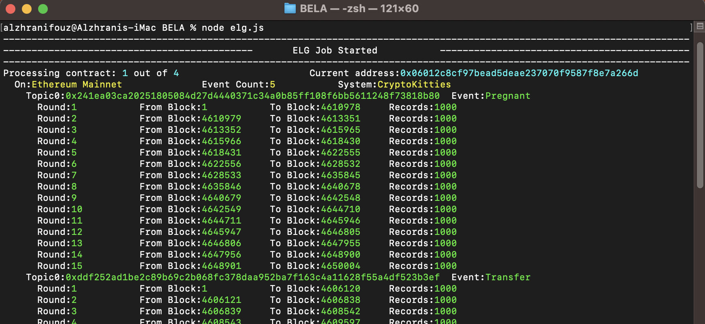
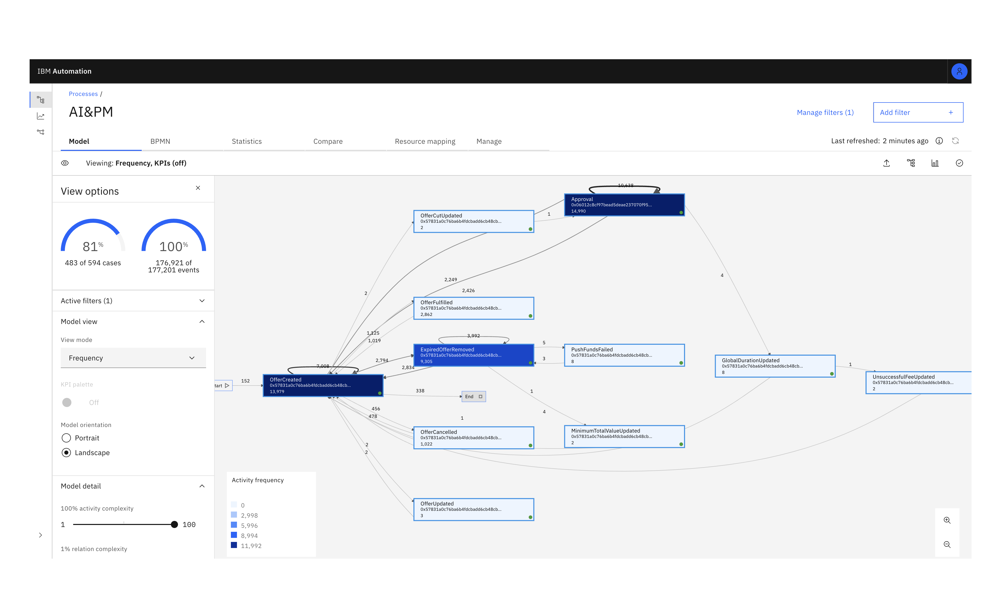

# BELA: Blockchain Event Log App


## What it does
The application consists of two modules: Process Awareness Recognizer (PAR) and Event Log Generator (ELG). PAR is a rule-based classifier to assess the process awareness of a given blockchain application. ELG is an automated model consisting of three methods: 1) Extractor: an algorithm for event data retrieval from blockchain networks, 2) Decoder: a data decoding algorithm to transform the extracted event data to a human-readable format, and 3) Formatter: an algorithm to produce event log files in a format that is compatible with PM tools. The application supports batch processing smart contracts on Ethereum virtual machine networks.


---

## Status
This project is developed during my PhD research at the University of Manchester. It is a proof of concept and will always remain in this state.

## Installation

download this project to your working directory:
```console
$ git clone https://github.com/alzhraniFouz/BELA
```

install all dependencies with:
```console
$ npm install
```

## Usage

### 1. Connection
open the connection.js file and modify the variables according to your needs.

Example:

```json
    {
       "network":"Ethereum Mainnet",
       "api":"https://api.etherscan.io/api",
       "apiKey":"YOUR-API-KEY"
    }
```

### 2. Process Awareness Recognizer (PAR) Module
It is a rule-based classifier that identify suitable blockchain applications for process mining. It classifies a set of input smart contracts into two classes *Include* and *Exclude* and explains the *reason* for this classification. The set of subject contract addresses should be identified in *par-input-addresses.json*

run the script with
```console
$ node par.js
```
if everything works fine, you should get an output like below and a json file *par-report.json*.



### 3. Event Log Generator (ELG) Module
The *Included* smart contracts from PAR should be identified in *elg-input-addresses.json*. ELG extracts and format event data and export the event logs as CSV files for each blockchain application.

run the script with:
```console
$ node elg.js
```
if everything works fine, you should get an output like below and a json file *elg-report.json*.



After executing this script, a csv file is created inside */event-log/* for each blockchain application. This event log can then be used for process mining.


## Process Mining
It is now possible to apply Process Discovery methods to the generated event logs to derive process models. An example is given below for [CryptoKitties](https://www.cryptokitties.co/) application using [IBM Process Mining](https://www.ibm.com/products/process-mining).




## Built With

* [Node.js](https://nodejs.org/en/)
* [Etherscan API](https://etherscan.io/apis)
* [Web3 API](https://web3js.readthedocs.io/en/v1.8.1/)

---
## License

This project is licensed under the Apache-2.0 License - see the [LICENSE.md]() file for details
